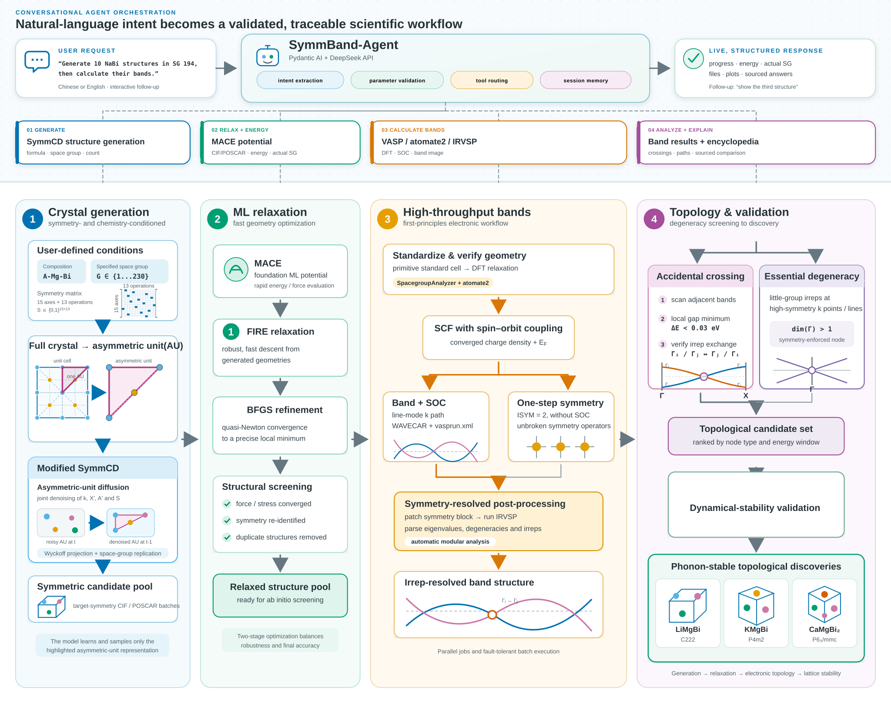

# SymmBand-Agent

Research workflow: see `research/README.md` for structure reclassification, Materials
Project novelty matching, ablations, surrogate models, and the fixed-budget DFT funnel.

完整的端到端执行逻辑、必需文件和禁止上传内容见 [`WORKFLOW.md`](WORKFLOW.md)，
GitHub 发布边界见 [`RELEASE_MANIFEST.md`](RELEASE_MANIFEST.md)。



SymmBand-Agent 是一个对话式晶体结构生成与能带计算项目。用户可以直接输入：

```text
我要生成10个194号空间群的NaBi结构，然后计算它的能带
```

Agent 会依次执行：

1. Pydantic AI 调用 DeepSeek，将自然语言解析为化学式、空间群号和采样数。
2. SymmCD 使用 `epoch699.ckpt` 进行条件扩散采样。
3. MACE 对生成结构进行弛豫，并筛选元素和空间群都符合要求的 POSCAR。
4. atomate2/jobflow 对合格 POSCAR 执行 VASP Relax、SOC-SCF、SOC-Band 和对称性计算。
5. IRVSP 分析不可约表示，最终生成 `band_*.png`。

## 目录结构

```text
SymmBand-Agent/
├── structure_agent.py          对话 Agent 主入口
├── workflow_sym.py             SymmCD + MACE 结构生成
├── mace_energy.py              已有 CIF/POSCAR 的 MACE 单点能计算
├── band_workflow.py            能带子进程桥接
├── band_result_analysis.py     已完成能带的偶然简并与百科路径比对
├── emergent_particles.py       本地演生粒子索引查询
├── input_structures/           用户提供的 CIF/POSCAR 输入目录
├── symmcd/                     checkpoint 推理所需源码
├── inverse_design/             新颖性、代理模型、漏斗与TDS-inspired SMC
├── research_models/particles/  可部署DP代理及审计文件
├── emergent particles/         token-efficient百科JSON索引
├── band_analysis/              atomate2/VASP/IRVSP 能带工作流
├── vendor/pydantic-ai/         Pydantic AI 运行时源码快照
├── epoch699.ckpt               SymmCD checkpoint（Git LFS）
├── macemodel/                  本地 MACE 模型（Git LFS）
├── cluster_environment/        Conda/pip、集群和 Slurm 配置
├── tests/                      Agent 与桥接层测试
└── scripts/                    GitHub 仓库初始化脚本
```

## 快速开始

Linux/GPU 集群推荐：

```bash
cd cluster_environment
bash install.sh conda gpu
conda activate symmcd-band-agent
cd ..
```

复制并编辑 Agent 配置：

```bash
cp .env.agent.example .env.agent
chmod 600 .env.agent
vi .env.agent
```

配置完成后检查：

```bash
python cluster_environment/validate_environment.py --python-only
python structure_agent.py --show-config
python structure_agent.py --check-band
```

运行：

```bash
python structure_agent.py
python structure_agent.py --prompt "我要生成10个194号空间群的NaBi结构，然后计算它的能带"
```

### Windows 交互式使用

在项目根目录激活 Conda 环境后执行一次可编辑安装：

```powershell
conda activate symmcd
python -m pip install --no-deps --no-build-isolation -e .
```

之后可在任意目录用下面的命令进入连续对话：

```text
symmband
symmband ➤ 生成10个194号空间群的BN结构
symmband ➤ 给出生成的第三个结构的形成能和空间群
```

生成期间会实时显示采样进度。每个通过验收的结构都会显示验收编号、MACE 总势能、
每原子势能和实际空间群。这里的 MACE 势能不是严格热力学形成能；追问“形成能”时，
Agent 会说明该限制并返回当前可用的 MACE 能量。输入 `/exit` 退出对话。

Windows 默认使用 `MACE_DEVICE=cpu`，兼容性最好。如果改为 `cuda`，需要确保当前 PyTorch/CUDA
环境包含匹配版本的 `nvrtc-builtins64_*.dll`；否则 MACE 弛豫会失败，但 SymmCD 生成阶段不受影响。

### 检索演生粒子百科

补充材料 Tables S1/S2 已预处理为本地索引。进入 `symmband` 后可以直接询问：

```text
symmband ➤ 我想知道194号空间群考虑SOC时所有可能存在的演生粒子有哪些
```

Agent 会分别列出本征简并与偶然简并，并注明来源表和 PDF 页码。日常查询只读取
`emergent particles/emergent_particles_index.json` 中对应空间群的一条记录，不会把 1228 页 PDF
发送给大模型。只有补充材料更新时，才需要使用带有 `pypdf` 的环境重新构建索引：

还可以继续询问偶然简并所在的高对称路径，例如：

```text
symmband ➤ 给出216号空间群考虑SOC时的偶然简并及其高对称路径
```

路径数据来自补充材料 S7B/S8B 的逐空间群表，并包含线路符号、端点和对应 PDF 页码。

### 分析已完成的能带结果

将从集群取回的单个材料结果目录放入 `calculation_results/`，例如：

```text
calculation_results/NaBi_sg186_007/
```

结果中需要包含完成的 SOC line-mode VASP 作业（`vasprun.xml` 或 `vasprun.xml.gz`）、IRVSP
输出 `outir` 和 `INCAR`。进入交互模式后可直接询问：

```text
symmband ➤ 分析NaBi结果中偶然简并都有哪些
```

Agent 会自动定位材料目录和 band job，复现 band 图红圈使用的“小能隙局部极小值 + 相邻能带
不可约表示对换”检测，把每个红圈映射到对应高对称路径，再与当前空间群及 SOC 条件下的
补充材料 S2/S8B 索引比对，并输出逐路径百科允许粒子对照表。结果保存在：

```text
calculation_results/<result>/agent_analysis/accidental_degeneracy_report.json
```

`confirmed_by_unique_path` 表示该路径在索引中只对应一种偶然简并；
`path_compatible_ambiguous` 表示同一路径允许多种粒子，只能列为候选，不能仅凭一维能带路径
唯一判断点、线或节线网。该过程读取本地 JSON 索引，不会把补充材料全文发送给大模型。

```powershell
python scripts/build_emergent_particle_index.py
```

### 计算已有结构的 MACE 能量

把 CIF 或 POSCAR 放入 `input_structures/`，例如：

```text
input_structures/graphene.cif
```

然后运行对话或单次命令：

```bash
python structure_agent.py --prompt "我要计算这个 graphene.cif 的能量"
```

Agent 会对原始结构执行未弛豫的 MACE 单点计算，并输出总能量（eV）和每原子能量（eV/atom）。JSON 报告位于：

```text
calculation_results/mace_energy/<structure>_<timestamp>/mace_energy.json
```

该数值是所配置 MACE 模型的势能预测，不是 DFT 能量、形成能或 `E_hull`。`E_hull` 需要同一化学体系的元素参考和竞争相能量来构造凸包，不能由单个结构的 MACE 总能量直接得到。

完整的 VASP、POTCAR、IRVSP 和 Slurm 配置见
[`cluster_environment/README.md`](cluster_environment/README.md)。

## 输出

结构默认输出到：

```text
generated_structures/<formula>_sg<spacegroup>/run_<timestamp>/
```

能带图片默认输出到对应任务的：

```text
band_analysis/bands/band_*.png
```

如果设置 `BAND_OUTPUT_ROOT`，图片会写入：

```text
<BAND_OUTPUT_ROOT>/<formula>_sg<spacegroup>/run_<timestamp>/bands/
```

“生成 10 个”表示执行 10 次扩散采样。只有通过最终元素和空间群验收的结构才进入 VASP，所以图片数量可能少于 10。

## 上传 GitHub

`epoch699.ckpt` 约 725 MB，超过 GitHub 普通 Git 的 100 MiB 单文件限制，必须使用 Git LFS。项目已经在 `.gitattributes` 中配置好模型规则。

发布前先运行自动审计：

```bash
python scripts/release_audit.py
```

Windows PowerShell：

```powershell
Set-ExecutionPolicy -Scope Process Bypass
.\scripts\prepare_github.ps1
```

Linux/macOS/Git Bash：

```bash
bash scripts/prepare_github.sh
```

检查 LFS 和暂存内容后提交：

```bash
git status --short
git lfs ls-files
git commit -m "Initial SymmBand-Agent monorepo"
gh repo create SymmBand-Agent --source=. --private --push
```

如果没有安装 GitHub CLI，先在 GitHub 网页创建一个空的私有仓库，然后执行：

```bash
git remote add origin https://github.com/<YOUR_ACCOUNT>/SymmBand-Agent.git
git push -u origin main
```

首次建议创建私有仓库。确认 `THIRD_PARTY_NOTICES.md` 中提到的 SymmCD、能带代码和模型权利后，再决定是否公开。

## 安全与版本控制

- `.env.agent`、API key、POTCAR、VASP 输出、生成结构和 band 结果均被 `.gitignore` 排除。
- 仓库只保留 Pydantic AI 运行所需的两个包，并完整保留其 MIT 许可证。
- 克隆仓库前需要安装 Git LFS，然后执行 `git lfs pull` 获取模型文件。
- 不要将 POTCAR 上传到 GitHub。

## 许可证

Pydantic AI 的 MIT 许可证保存在 `vendor/pydantic-ai/`。其余代码与模型在原目录中没有附带许可证；公开仓库前请先确认并补充相应授权。详见 `THIRD_PARTY_NOTICES.md`。
